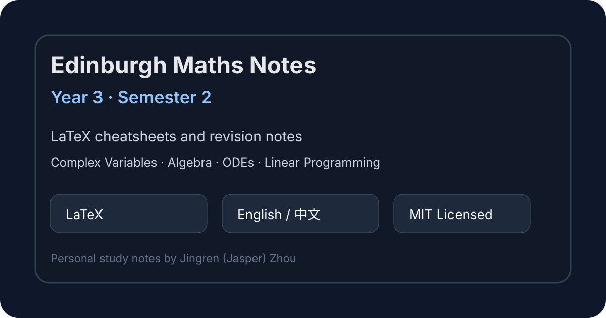

# Edinburgh Maths Year 3 Notes – Semester 2



A curated collection of my personal **LaTeX revision notes and cheatsheets** for **Year 3 Mathematics, Semester 2** at the **University of Edinburgh**.

These notes were prepared for exam revision and long-term reference. They are released publicly in a cleaned repository structure so that others can browse, adapt, or learn from them.

## Courses included

| Course | Folder | Notes |
|---|---:|---|
| Honours Complex Variables | `HCV/Note/` | Complex analysis concepts, theorem summaries, contour methods, and revision notes |
| Honours Algebra | `HAlg/Note/` | Group/ring/module-related algebra material, definitions, examples, and proof sketches |
| Numerical ODEs and Applications | `NODEA/Note/` | Numerical methods for ODEs, stability ideas, and computational revision summaries |
| Linear Programming, Modelling and Solution | `LPMS/Note/` | Linear programming models, simplex-style ideas, optimisation concepts, and formulas |

## Repository structure

```text
.
├── HAlg/Note/      # Honours Algebra notes
├── HCV/Note/       # Honours Complex Variables notes
├── NODEA/Note/     # Numerical ODEs and Applications notes
├── LPMS/Note/      # Linear Programming, Modelling and Solution notes
├── assets/         # README images and preview assets
├── .gitignore      # LaTeX/editor build artefact exclusions
├── LICENSE         # MIT License
└── README.md
```

## Features

- Written in **LaTeX**
- Bilingual notes: **English and Chinese** where helpful
- Designed for fast exam revision and concept lookup
- Includes formulas, theorem statements, worked ideas, and proof outlines
- Cleaned for public release: generated LaTeX logs and local build artefacts are excluded

## How to use

You can either read the compiled PDFs if present, or compile the `.tex` files yourself with XeLaTeX.

```bash
xelatex "Note File.tex"
```

For documents with references or tables of contents, run XeLaTeX more than once.

## Disclaimer

These are personal study notes and may contain mistakes, omissions, or non-standard explanations. They are **not official University of Edinburgh course materials**. Please use them as supplementary revision material only.

## License

Released under the [MIT License](LICENSE). You may use, adapt, and share the notes, but please keep the copyright and license notice.
